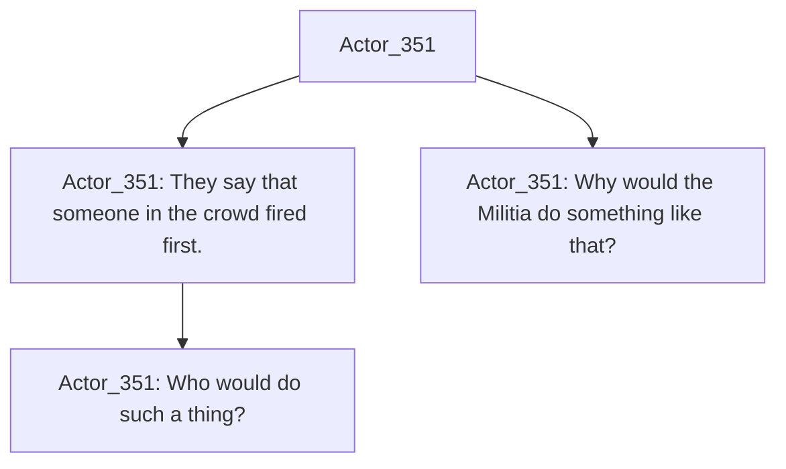

# Characters/Nye

```mermaid
graph TD
    351_0["Actor_351"]
    351_1["Actor_351: They say that someone in the crowd fired first."]
    351_2["Actor_351: Who would do such a thing?"]
    351_3["Actor_351: Why would the Militia do something like that?"]
    351_0 --> 351_1
    351_0 --> 351_3
    351_1 --> 351_2
```