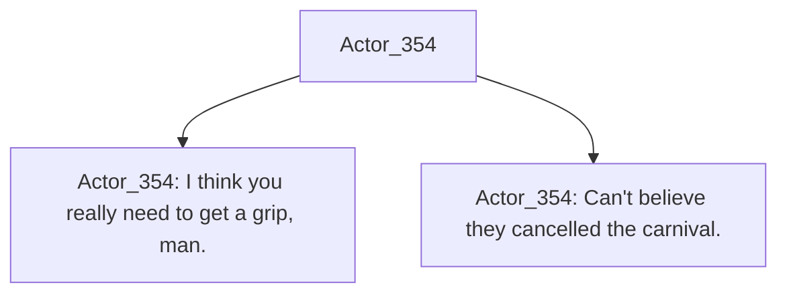

# Characters/Oskar

```mermaid
graph TD
    354_0["Actor_354"]
    354_1["Actor_354: I think you really need to get a grip, man."]
    354_2["Actor_354: Can't believe they cancelled the carnival."]
    354_0 --> 354_1
    354_0 --> 354_2
```