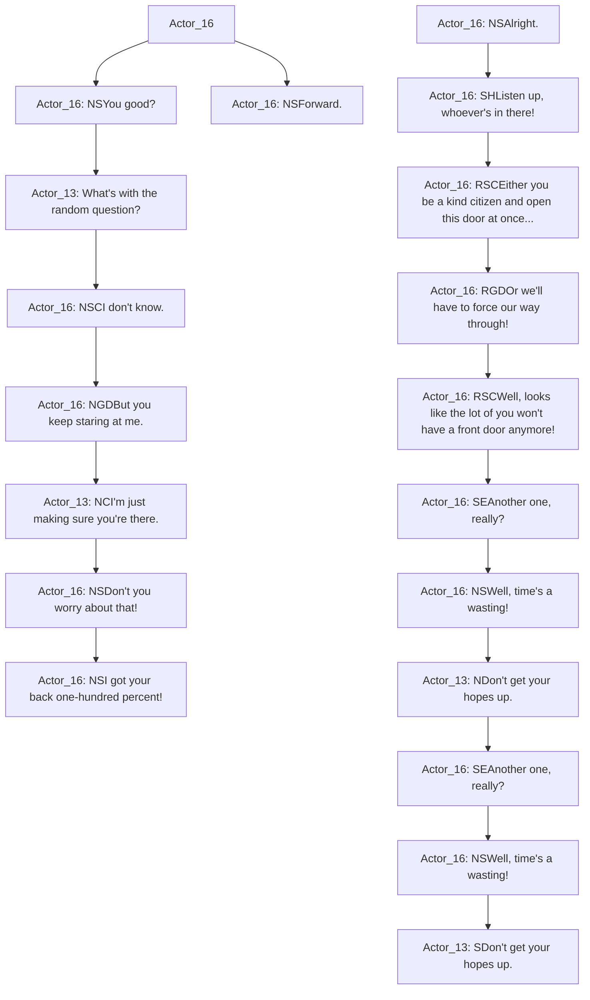

# Characters/Pandora

```mermaid
graph TD
    780_0["Actor_16"]
    780_1["Actor_16: NSYou good?"]
    780_2["Actor_13: What's with the random question?"]
    780_3["Actor_16: NGDBut you keep staring at me."]
    780_4["Actor_16: NSDon't you worry about that!"]
    780_5["Actor_16: NSI got your back one-hundred percent!"]
    780_6["Actor_16: NSAlright."]
    780_7["Actor_16: SHListen up, whoever's in there!"]
    780_8["Actor_16: RSCEither you be a kind citizen and open this door at once..."]
    780_9["Actor_16: RGDOr we'll have to force our way through!"]
    780_10["Actor_16: RSCWell, looks like the lot of you won't have a front door anymore!"]
    780_11["Actor_16: SEAnother one, really?"]
    780_12["Actor_16: NSWell, time's a wasting!"]
    780_13["Actor_13: NDon't get your hopes up."]
    780_14["Actor_16: SEAnother one, really?"]
    780_15["Actor_16: NSWell, time's a wasting!"]
    780_16["Actor_13: SDon't get your hopes up."]
    780_17["Actor_16: NSForward."]
    780_20["Actor_13: NCI'm just making sure you're there."]
    780_21["Actor_16: NSCI don't know."]
    780_0 --> 780_1
    780_0 --> 780_17
    780_1 --> 780_2
    780_2 --> 780_21
    780_3 --> 780_20
    780_4 --> 780_5
    780_6 --> 780_7
    780_7 --> 780_8
    780_8 --> 780_9
    780_9 --> 780_10
    780_10 --> 780_11
    780_11 --> 780_12
    780_12 --> 780_13
    780_13 --> 780_14
    780_14 --> 780_15
    780_15 --> 780_16
    780_20 --> 780_4
    780_21 --> 780_3
```