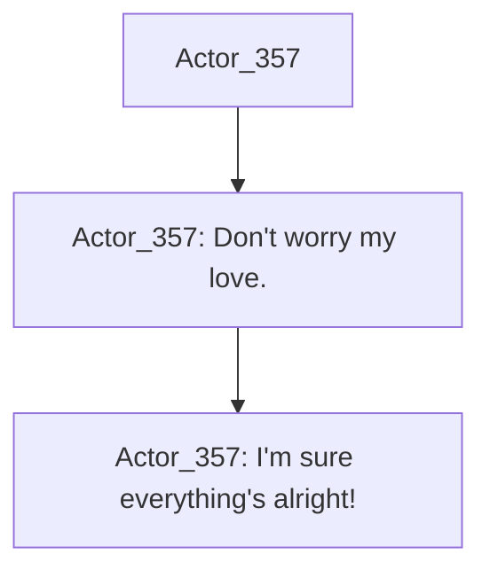

# Characters/Pascal

```mermaid
graph TD
    358_0["Actor_357"]
    358_1["Actor_357: Don't worry my love."]
    358_2["Actor_357: I'm sure everything's alright!"]
    358_0 --> 358_1
    358_1 --> 358_2
```