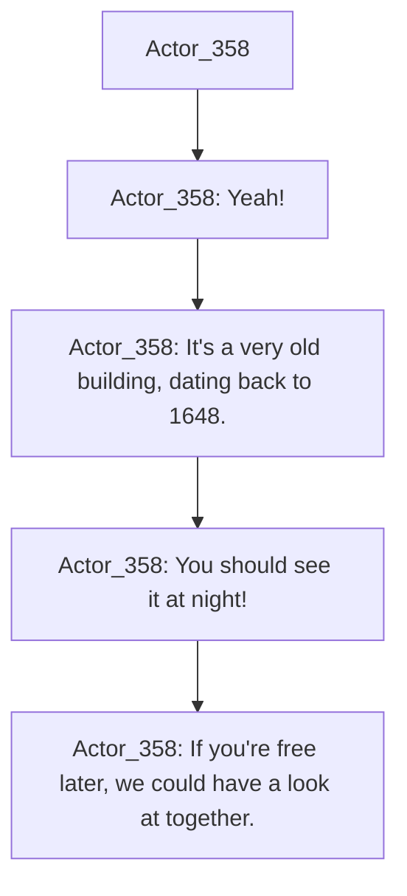

# Characters/Paskal

```mermaid
graph TD
    359_0["Actor_358"]
    359_1["Actor_358: Yeah!"]
    359_2["Actor_358: It's a very old building, dating back to 1648."]
    359_3["Actor_358: You should see it at night!"]
    359_4["Actor_358: If you're free later, we could have a look at together."]
    359_0 --> 359_1
    359_1 --> 359_2
    359_2 --> 359_3
    359_3 --> 359_4
```