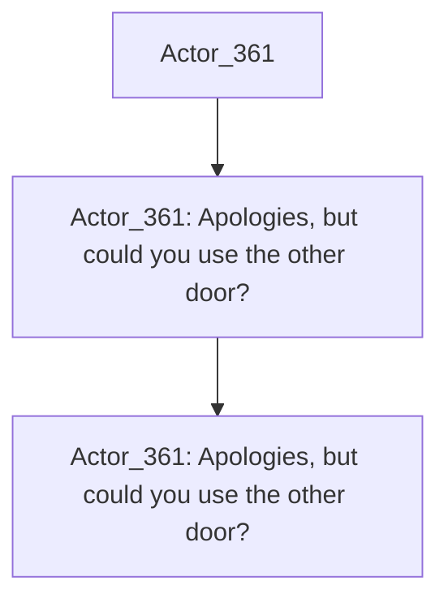

# Characters/Pavle

```mermaid
graph TD
    362_0["Actor_361"]
    362_1["Actor_361: Apologies, but could you use the other door?"]
    362_2["Actor_361: Apologies, but could you use the other door?"]
    362_0 --> 362_1
    362_1 --> 362_2
```