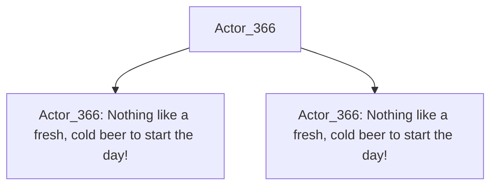

# Characters/Petri

```mermaid
graph TD
    366_0["Actor_366"]
    366_1["Actor_366: Nothing like a fresh, cold beer to start the day!"]
    366_2["Actor_366: Nothing like a fresh, cold beer to start the day!"]
    366_0 --> 366_1
    366_0 --> 366_2
```