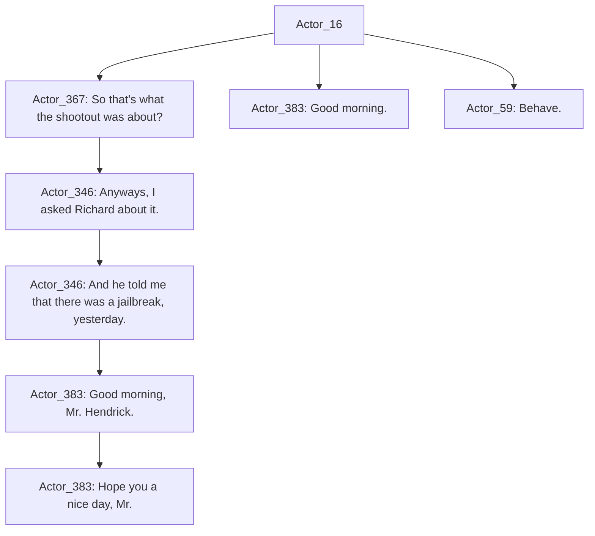

# Characters/Petros

```mermaid
graph TD
    88_0["Actor_16"]
    88_1["Actor_367: So that's what the shootout was about?"]
    88_2["Actor_346: Anyways, I asked Richard about it."]
    88_3["Actor_346: And he told me that there was a jailbreak, yesterday."]
    88_4["Actor_383: Good morning, Mr. Hendrick."]
    88_5["Actor_383: Hope you a nice day, Mr."]
    88_6["Actor_383: Good morning."]
    88_167["Actor_59: Behave."]
    88_0 --> 88_167
    88_0 --> 88_1
    88_0 --> 88_6
    88_1 --> 88_2
    88_2 --> 88_3
    88_3 --> 88_4
    88_4 --> 88_5
```