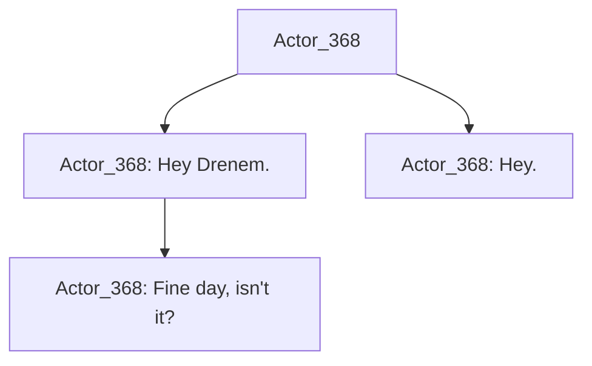

# Characters/Philip

```mermaid
graph TD
    367_0["Actor_368"]
    367_1["Actor_368: Hey Drenem."]
    367_2["Actor_368: Fine day, isn't it?"]
    367_3["Actor_368: Hey."]
    367_0 --> 367_1
    367_0 --> 367_3
    367_1 --> 367_2
```