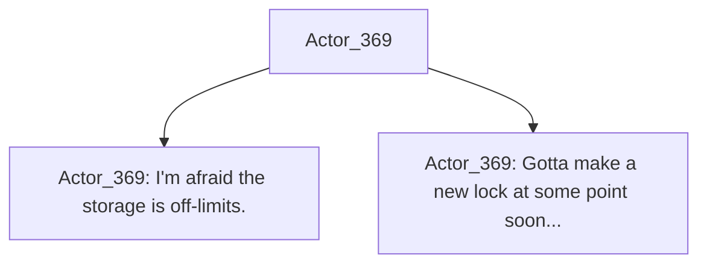

# Characters/Prolov

```mermaid
graph TD
    368_0["Actor_369"]
    368_1["Actor_369: I'm afraid the storage is off-limits."]
    368_2["Actor_369: Gotta make a new lock at some point soon..."]
    368_0 --> 368_1
    368_0 --> 368_2
```