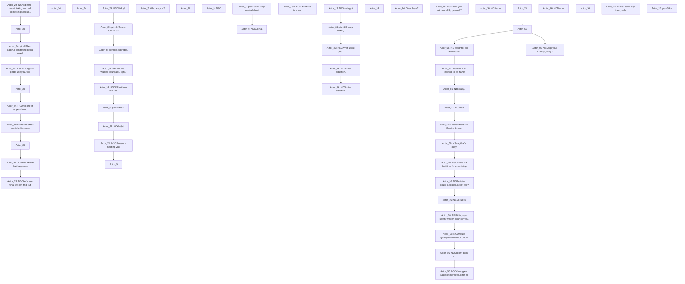

# Characters/Prometheus

```mermaid
graph TD
    53_0["Actor_24"]
    53_19["Actor_24"]
    53_26["Actor_24"]
    53_29["Actor_24: NCAnd here I was thinking we had something special..."]
    53_30["Actor_24"]
    53_31["Actor_24: pic=6Then again, I don't mind being used."]
    53_32["Actor_24: NSCAs long as I get to use you, too."]
    53_33["Actor_24"]
    53_34["Actor_24: pic=6But before that happens..."]
    53_36["Actor_24: NSCLet's see what we can find out!"]
    53_40["Actor_24: RCUntil one of us gets bored."]
    53_41["Actor_24: RAnd the other one is left in tears."]
    53_42["Actor_24"]
    53_75["Actor_7: Who are you?"]
    53_80["Actor_20"]
    53_83["Actor_56"]
    53_86["Actor_5: NSC"]
    53_88["Actor_5: NSCLorna."]
    53_90["Actor_24: NSCVicky!"]
    53_91["Actor_24: pic=10Take a look at th-"]
    53_92["Actor_5: pic=6It's adorable."]
    53_93["Actor_5: NSCBut we wanted to unpack, right?"]
    53_94["Actor_24: NSCI'll be there in a sec-"]
    53_95["Actor_5: pic=10Now."]
    53_96["Actor_16: NSCI'll be there in a sec-"]
    53_97["Actor_24: NCAlright."]
    53_98["Actor_24: NSCPleasure meeting you!"]
    53_102["Actor_5: pic=6She's very excited about "]
    53_104["Actor_24"]
    53_110["Actor_24: Over there?"]
    53_146["Actor_5"]
    53_149["Actor_56: NSReady for our adventure?"]
    53_156["Actor_16: NSCWere you out here all by yourself?"]
    53_159["Actor_16: NCDamn."]
    53_160["Actor_23: NCIt's alright."]
    53_161["Actor_16: NCDamn."]
    53_162["Actor_23: pic=6I'll keep looking."]
    53_163["Actor_23: NSCWhat about you?"]
    53_166["Actor_16: NCSimilar situation."]
    53_167["Actor_16: NCSimilar situation."]
    53_168["Actor_16"]
    53_172["Actor_23: NCYou could say that, yeah."]
    53_174["Actor_16: pic=6Hm."]
    53_213["Actor_16: NGDI'm a bit terrified, to be frank!"]
    53_214["Actor_56: NSReally?"]
    53_215["Actor_16: NCYeah."]
    53_216["Actor_56: NSKeep your chin up, okay?"]
    53_217["Actor_16: I never dealt with Goblins before."]
    53_218["Actor_56: NSAw, that's okay!"]
    53_220["Actor_56: NSCThere's a first time for everything."]
    53_221["Actor_56: NSBesides: You're a soldier, aren't you?"]
    53_222["Actor_16: NSCI guess."]
    53_223["Actor_56: NSIf things go south, we can count on you."]
    53_225["Actor_16: NGDYou're giving me too much credit!"]
    53_226["Actor_56: NSCI don't think so."]
    53_234["Actor_56: NGDI'm a great judge of character, after all."]
    53_0 --> 53_83
    53_29 --> 53_30
    53_30 --> 53_31
    53_31 --> 53_32
    53_32 --> 53_33
    53_33 --> 53_40
    53_34 --> 53_36
    53_40 --> 53_41
    53_41 --> 53_42
    53_42 --> 53_34
    53_83 --> 53_149
    53_83 --> 53_216
    53_90 --> 53_91
    53_91 --> 53_92
    53_92 --> 53_93
    53_93 --> 53_94
    53_94 --> 53_95
    53_95 --> 53_97
    53_97 --> 53_98
    53_98 --> 53_146
    53_102 --> 53_88
    53_149 --> 53_213
    53_160 --> 53_162
    53_162 --> 53_163
    53_163 --> 53_166
    53_166 --> 53_167
    53_213 --> 53_214
    53_214 --> 53_215
    53_215 --> 53_217
    53_217 --> 53_218
    53_218 --> 53_220
    53_220 --> 53_221
    53_221 --> 53_222
    53_222 --> 53_223
    53_223 --> 53_225
    53_225 --> 53_226
    53_226 --> 53_234
```