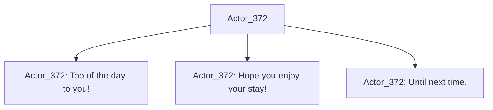

# Characters/Ralph

```mermaid
graph TD
    372_0["Actor_372"]
    372_1["Actor_372: Top of the day to you!"]
    372_2["Actor_372: Hope you enjoy your stay!"]
    372_3["Actor_372: Until next time."]
    372_0 --> 372_1
    372_0 --> 372_2
    372_0 --> 372_3
```