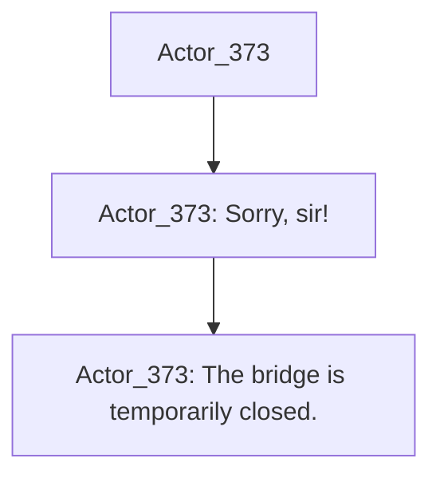

# Characters/Ranulph

```mermaid
graph TD
    373_0["Actor_373"]
    373_1["Actor_373: Sorry, sir!"]
    373_2["Actor_373: The bridge is temporarily closed."]
    373_0 --> 373_1
    373_1 --> 373_2
```