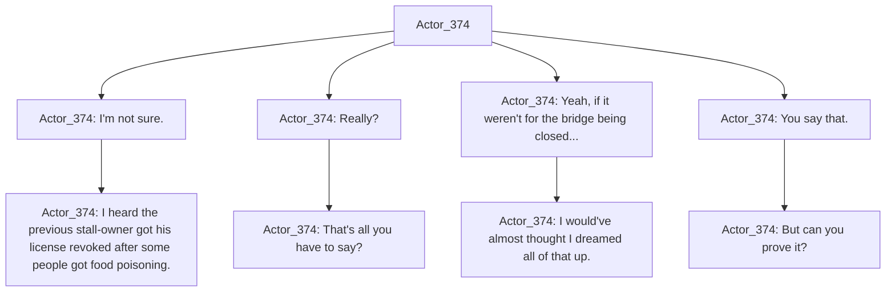

# Characters/Reinout

```mermaid
graph TD
    374_0["Actor_374"]
    374_1["Actor_374: I'm not sure."]
    374_2["Actor_374: I heard the previous stall-owner got his license revoked after some people got food poisoning."]
    374_3["Actor_374: Really?"]
    374_4["Actor_374: That's all you have to say?"]
    374_5["Actor_374: Yeah, if it weren't for the bridge being closed..."]
    374_6["Actor_374: I would've almost thought I dreamed all of that up."]
    374_7["Actor_374: You say that."]
    374_8["Actor_374: But can you prove it?"]
    374_0 --> 374_1
    374_0 --> 374_3
    374_0 --> 374_5
    374_0 --> 374_7
    374_1 --> 374_2
    374_3 --> 374_4
    374_5 --> 374_6
    374_7 --> 374_8
```