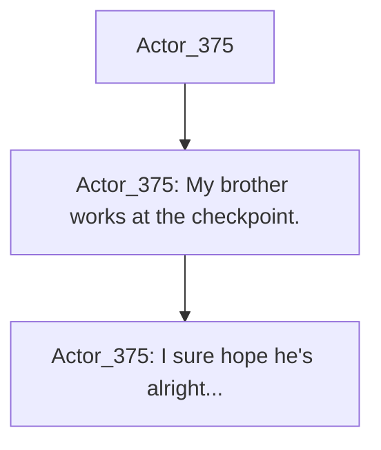

# Characters/Reuben

```mermaid
graph TD
    375_0["Actor_375"]
    375_1["Actor_375: My brother works at the checkpoint."]
    375_2["Actor_375: I sure hope he's alright..."]
    375_0 --> 375_1
    375_1 --> 375_2
```