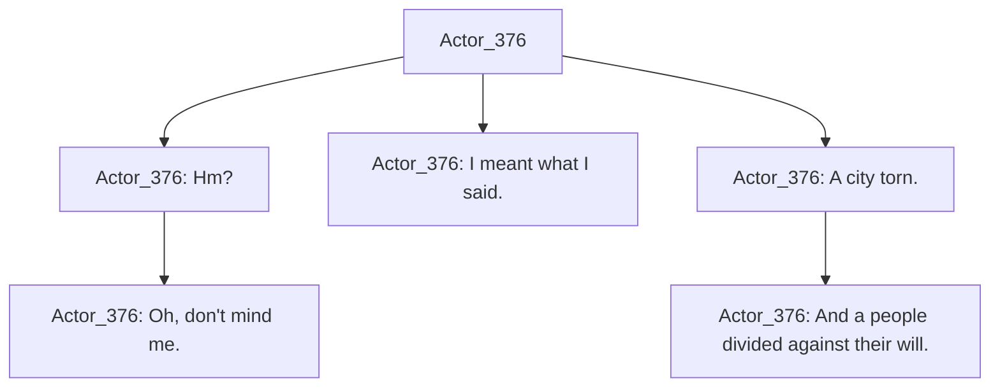

# Characters/Rikard

```mermaid
graph TD
    376_0["Actor_376"]
    376_1["Actor_376: Hm?"]
    376_2["Actor_376: Oh, don't mind me."]
    376_3["Actor_376: I meant what I said."]
    376_4["Actor_376: A city torn."]
    376_5["Actor_376: And a people divided against their will."]
    376_0 --> 376_1
    376_0 --> 376_3
    376_0 --> 376_4
    376_1 --> 376_2
    376_4 --> 376_5
```