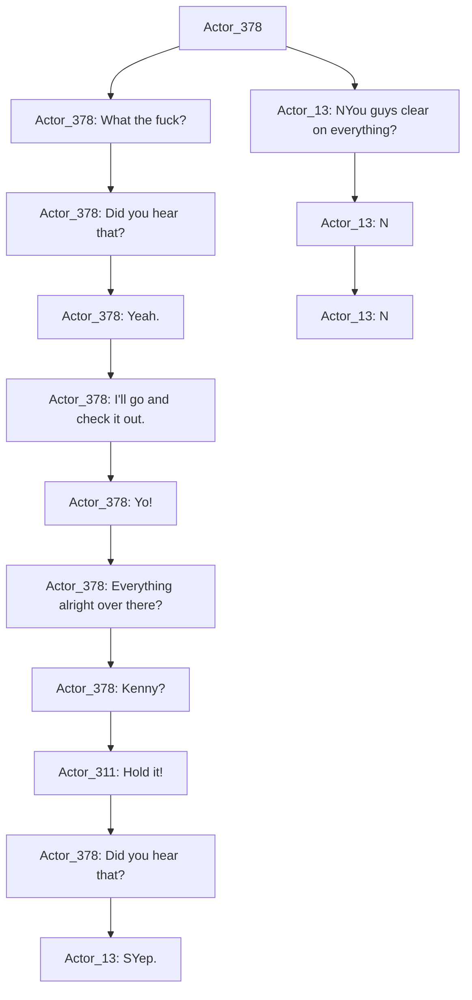

# Characters/Robin

```mermaid
graph TD
    378_0["Actor_378"]
    378_1["Actor_378: What the fuck?"]
    378_2["Actor_378: Did you hear that?"]
    378_3["Actor_378: Yeah."]
    378_4["Actor_378: I'll go and check it out."]
    378_5["Actor_378: Yo!"]
    378_6["Actor_378: Everything alright over there?"]
    378_7["Actor_378: Kenny?"]
    378_8["Actor_311: Hold it!"]
    378_9["Actor_378: Did you hear that?"]
    378_10["Actor_13: SYep."]
    378_11["Actor_13: NYou guys clear on everything?"]
    378_12["Actor_13: N"]
    378_13["Actor_13: N"]
    378_0 --> 378_1
    378_0 --> 378_11
    378_1 --> 378_2
    378_2 --> 378_3
    378_3 --> 378_4
    378_4 --> 378_5
    378_5 --> 378_6
    378_6 --> 378_7
    378_7 --> 378_8
    378_8 --> 378_9
    378_9 --> 378_10
    378_11 --> 378_12
    378_12 --> 378_13
```