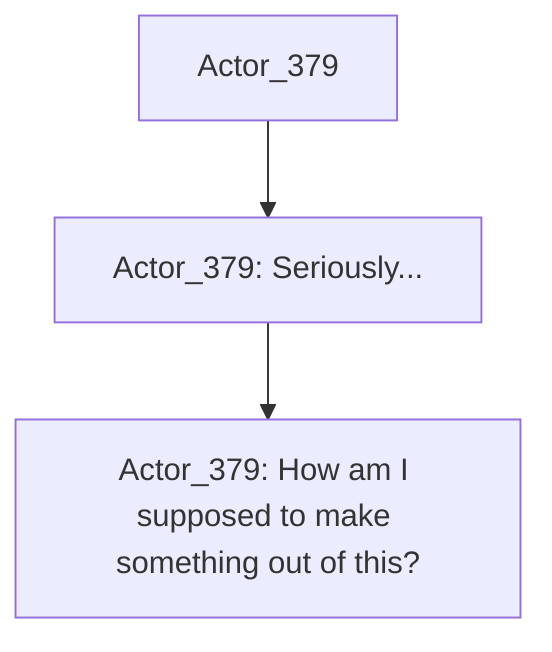

# Characters/Rocky

```mermaid
graph TD
    379_0["Actor_379"]
    379_1["Actor_379: Seriously..."]
    379_2["Actor_379: How am I supposed to make something out of this?"]
    379_0 --> 379_1
    379_1 --> 379_2
```