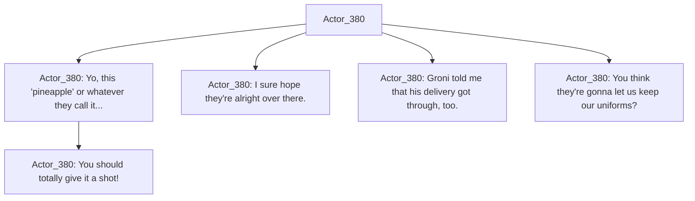

# Characters/Roffe

```mermaid
graph TD
    380_0["Actor_380"]
    380_1["Actor_380: Yo, this 'pineapple' or whatever they call it..."]
    380_2["Actor_380: You should totally give it a shot!"]
    380_3["Actor_380: I sure hope they're alright over there."]
    380_4["Actor_380: Groni told me that his delivery got through, too."]
    380_5["Actor_380: You think they're gonna let us keep our uniforms?"]
    380_0 --> 380_1
    380_0 --> 380_3
    380_0 --> 380_4
    380_0 --> 380_5
    380_1 --> 380_2
```