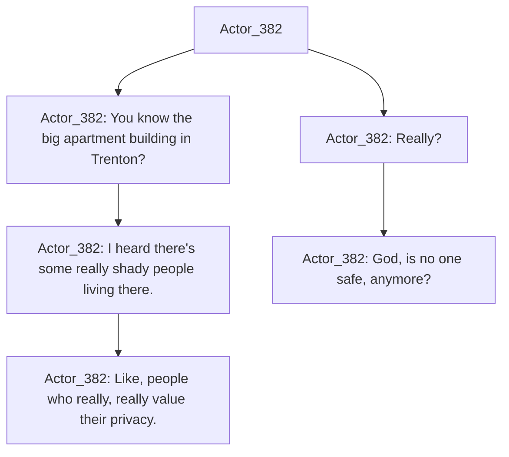

# Characters/Rosa

```mermaid
graph TD
    382_0["Actor_382"]
    382_1["Actor_382: You know the big apartment building in Trenton?"]
    382_2["Actor_382: I heard there's some really shady people living there."]
    382_3["Actor_382: Like, people who really, really value their privacy."]
    382_4["Actor_382: Really?"]
    382_5["Actor_382: God, is no one safe, anymore?"]
    382_0 --> 382_1
    382_0 --> 382_4
    382_1 --> 382_2
    382_2 --> 382_3
    382_4 --> 382_5
```