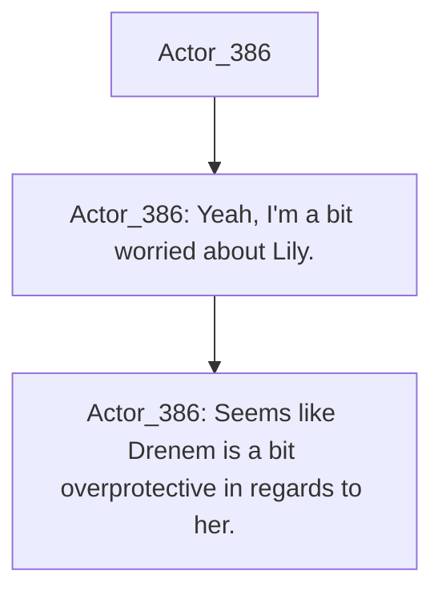

# Characters/Samuel

```mermaid
graph TD
    386_0["Actor_386"]
    386_1["Actor_386: Yeah, I'm a bit worried about Lily."]
    386_2["Actor_386: Seems like Drenem is a bit overprotective in regards to her."]
    386_0 --> 386_1
    386_1 --> 386_2
```