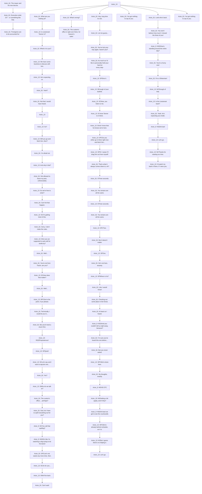

# Characters/Samuil

```mermaid
graph TD
    90_0["Actor_13"]
    90_1["Actor_61: What are you looking at?"]
    90_2["Actor_13: Is Lieutenant Tanner in?"]
    90_3["Actor_61: What's it to you?"]
    90_4["Actor_13: We have some business to discuss with him."]
    90_5["Actor_61: Yeah?"]
    90_8["Actor_13"]
    90_9["Actor_13: So?"]
    90_10["Actor_13: Will you go and fetch him, then?"]
    90_11["Actor_61: I'm afraid not."]
    90_12["Actor_13: And why's that?"]
    90_13["Actor_61: Not allowed to leave my post, unfortunately."]
    90_14["Actor_13: So we're free to enter?"]
    90_22["Actor_13: SCI'm getting tired of this."]
    90_23["Actor_61: Sorry, I don't make the rules."]
    90_24["Actor_13: SAre you we supposed to wait until he strolls by?"]
    90_25["Actor_61: Well..."]
    90_26["Actor_61: You're not from Trachi, are you?"]
    90_91["Actor_61: Can't let that happen."]
    90_93["Actor_61: The mayor and his new decree."]
    90_94["Actor_61: Executive order 157 – or something like that."]
    90_95["Actor_61: 'Foreigners are to be accounted for.'"]
    90_96["Actor_13: He's expecting us."]
    90_97["Actor_61: Not that I would have heard."]
    90_98["Actor_13: SCHow does that matter?"]
    90_99["Actor_61: Well..."]
    90_100["Actor_13: SPCGet to the point, if you please."]
    90_101["Actor_61: Technically, I could let you in..."]
    90_102["Actor_61: But you'd need a visum first."]
    90_103["Actor_10: RGDPreposterous!"]
    90_104["Actor_13: SPQuiet!"]
    90_105["Actor_13: SCLet's say we'd want to aqcuire one..."]
    90_106["Actor_61: Yes?"]
    90_107["Actor_13: SWho do we talk to?"]
    90_108["Actor_61: The custom's office.... perhaps?"]
    90_109["Actor_61: God, do I have to spell everything out for you?"]
    90_110["Actor_9: NCYou call that spelling?"]
    90_111["Actor_9: NGDIt's like I'm watching a dog trying to do his taxes!"]
    90_112["Actor_61: SPCLet's not waste any more time, then."]
    90_113["Actor_13: SCAs for you..."]
    90_114["Actor_13: SWe'll be back."]
    90_115["Actor_61: Can't wait!"]
    90_116["Actor_61: What's wrong?"]
    90_117["Actor_61: The custom's office is right over there, for heaven's\nsake!"]
    90_118["Actor_61: Hey, long time no see."]
    90_119["Actor_61: Let me guess..."]
    90_120["Actor_61: You've lost your way again, haven't you?"]
    90_121["Actor_61: As much as I'd like to personally hold your hand at\nevery step-"]
    90_122["Actor_13: SPShut it."]
    90_123["Actor_13: SEnough of your bullshit."]
    90_124["Actor_13: SCNow, you listen to me."]
    90_125["Actor_13: SI know Tanner is in there."]
    90_126["Actor_13: SAnd I know that he knows we're here."]
    90_127["Actor_13: SPCSo you either go in there right now and fetch him..."]
    90_128["Actor_13: SPOr I swear I'll drag him out here myself!"]
    90_129["Actor_61: That's what it always comes down to, eh?"]
    90_130["Actor_61: SThree seconds."]
    90_131["Actor_61: You Ionians are all the same."]
    90_132["Actor_13: SThree seconds."]
    90_133["Actor_61: You Ionians are all the same."]
    90_134["Actor_13: SPCTwo."]
    90_135["Actor_61: But it doesn't matter."]
    90_136["Actor_13: SPOne."]
    90_137["Actor_61: He's not here, anyway."]
    90_138["Actor_13: SPWhere is he?"]
    90_139["Actor_61: Like I would know!"]
    90_140["Actor_61: Checking out some place in the forest."]
    90_141["Actor_61: At least so I heard."]
    90_142["Actor_9: NGDAnd you couldn't tell us right away, because?"]
    90_143["Actor_61: I'm sure you've heard this one before..."]
    90_144["Actor_61: But you never asked."]
    90_145["Actor_13: SPCWe're done here."]
    90_146["Actor_61: My thoughts, exactly."]
    90_147["Actor_9: MOVE ETC"]
    90_148["Actor_10: NSGetting a bit uppity, aren't they?"]
    90_149["Actor_9: NGDAt least we get to see the countryside. "]
    90_150["Actor_13: SPCWe're already behind schedule, as it is."]
    90_151["Actor_13: NCBut I guess there's no helping it."]
    90_152["Actor_13: Let's go."]
    90_153["Actor_61: I've got nothing to say to you."]
    90_154["Actor_61: Look who's back."]
    90_155["Actor_61: You won't believe how much I missed the three of you!"]
    90_156["Actor_9: NGDHow's standing around the entire day?"]
    90_157["Actor_61: You're a funny one!"]
    90_158["Actor_61: For a Shiteonian!"]
    90_159["Actor_13: NCEnough of that."]
    90_160["Actor_13: Is the Lieutenant back?"]
    90_161["Actor_61: Yeah, he's expecting you inside."]
    90_162["Actor_9: NGDAt last!"]
    90_163["Actor_13: Let's go."]
    90_164["Actor_13: NCThanks for wasting our time."]
    90_165["Actor_13: I'd watch my back in there, if I were you."]
    90_166["Actor_61: I've got nothing to say to you."]
    90_0 --> 90_1
    90_0 --> 90_116
    90_0 --> 90_118
    90_0 --> 90_153
    90_0 --> 90_154
    90_0 --> 90_166
    90_1 --> 90_2
    90_2 --> 90_3
    90_3 --> 90_4
    90_4 --> 90_96
    90_5 --> 90_97
    90_8 --> 90_9
    90_9 --> 90_10
    90_10 --> 90_11
    90_11 --> 90_12
    90_12 --> 90_13
    90_13 --> 90_14
    90_14 --> 90_91
    90_22 --> 90_23
    90_23 --> 90_24
    90_24 --> 90_25
    90_25 --> 90_26
    90_26 --> 90_98
    90_91 --> 90_22
    90_93 --> 90_94
    90_94 --> 90_95
    90_96 --> 90_5
    90_97 --> 90_8
    90_98 --> 90_99
    90_99 --> 90_100
    90_100 --> 90_101
    90_101 --> 90_102
    90_102 --> 90_103
    90_103 --> 90_104
    90_104 --> 90_105
    90_105 --> 90_106
    90_106 --> 90_107
    90_107 --> 90_108
    90_108 --> 90_109
    90_109 --> 90_110
    90_110 --> 90_111
    90_111 --> 90_112
    90_112 --> 90_113
    90_113 --> 90_114
    90_114 --> 90_115
    90_116 --> 90_117
    90_118 --> 90_119
    90_119 --> 90_120
    90_120 --> 90_121
    90_121 --> 90_122
    90_122 --> 90_123
    90_123 --> 90_124
    90_124 --> 90_125
    90_125 --> 90_126
    90_126 --> 90_127
    90_127 --> 90_128
    90_128 --> 90_129
    90_129 --> 90_130
    90_130 --> 90_131
    90_131 --> 90_132
    90_132 --> 90_133
    90_133 --> 90_134
    90_134 --> 90_135
    90_135 --> 90_136
    90_136 --> 90_137
    90_137 --> 90_138
    90_138 --> 90_139
    90_139 --> 90_140
    90_140 --> 90_141
    90_141 --> 90_142
    90_142 --> 90_143
    90_143 --> 90_144
    90_144 --> 90_145
    90_145 --> 90_146
    90_146 --> 90_147
    90_147 --> 90_148
    90_148 --> 90_149
    90_149 --> 90_150
    90_150 --> 90_151
    90_151 --> 90_152
    90_154 --> 90_155
    90_155 --> 90_156
    90_156 --> 90_157
    90_157 --> 90_158
    90_158 --> 90_159
    90_159 --> 90_160
    90_160 --> 90_161
    90_161 --> 90_162
    90_162 --> 90_163
    90_163 --> 90_164
    90_164 --> 90_165
```