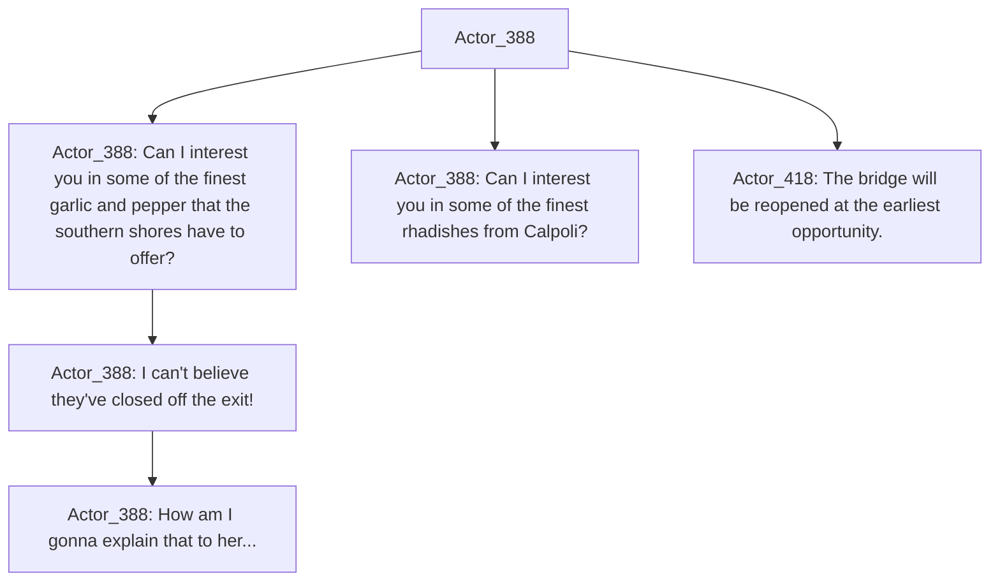

# Characters/Sasho

```mermaid
graph TD
    388_0["Actor_388"]
    388_1["Actor_388: Can I interest you in some of the finest garlic and pepper that the southern shores have to offer?"]
    388_2["Actor_388: I can't believe they've closed off the exit!"]
    388_3["Actor_388: How am I gonna explain that to her..."]
    388_4["Actor_388: Can I interest you in some of the finest rhadishes from Calpoli?"]
    388_5["Actor_418: The bridge will be reopened at the earliest opportunity."]
    388_0 --> 388_1
    388_0 --> 388_4
    388_0 --> 388_5
    388_1 --> 388_2
    388_2 --> 388_3
```