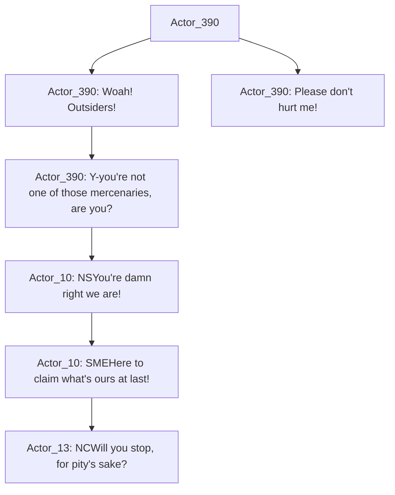

# Characters/Sebnem

```mermaid
graph TD
    390_0["Actor_390"]
    390_1["Actor_390: Woah! Outsiders!"]
    390_2["Actor_390: Y-you're not one of those mercenaries, are you?"]
    390_3["Actor_10: NSYou're damn right we are!"]
    390_4["Actor_10: SMEHere to claim what's ours at last!"]
    390_5["Actor_13: NCWill you stop, for pity's sake?"]
    390_6["Actor_390: Please don't hurt me!"]
    390_0 --> 390_1
    390_0 --> 390_6
    390_1 --> 390_2
    390_2 --> 390_3
    390_3 --> 390_4
    390_4 --> 390_5
```