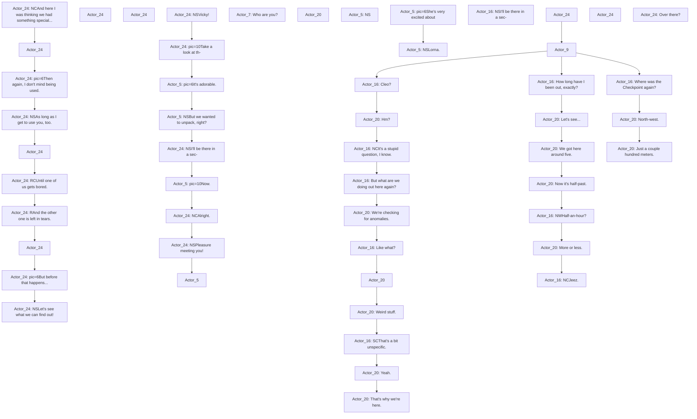

# Characters/Selene

```mermaid
graph TD
    71_0["Actor_24"]
    71_19["Actor_24"]
    71_26["Actor_24"]
    71_29["Actor_24: NCAnd here I was thinking we had something special..."]
    71_30["Actor_24"]
    71_31["Actor_24: pic=6Then again, I don't mind being used."]
    71_32["Actor_24: NSAs long as I get to use you, too."]
    71_33["Actor_24"]
    71_34["Actor_24: pic=6But before that happens..."]
    71_36["Actor_24: NSLet's see what we can find out!"]
    71_40["Actor_24: RCUntil one of us gets bored."]
    71_41["Actor_24: RAnd the other one is left in tears."]
    71_42["Actor_24"]
    71_75["Actor_7: Who are you?"]
    71_80["Actor_20"]
    71_83["Actor_9"]
    71_86["Actor_5: NS"]
    71_88["Actor_5: NSLorna."]
    71_90["Actor_24: NSVicky!"]
    71_91["Actor_24: pic=10Take a look at th-"]
    71_92["Actor_5: pic=6It's adorable."]
    71_93["Actor_5: NSBut we wanted to unpack, right?"]
    71_94["Actor_24: NSI'll be there in a sec-"]
    71_95["Actor_5: pic=10Now."]
    71_96["Actor_16: NSI'll be there in a sec-"]
    71_97["Actor_24: NCAlright."]
    71_98["Actor_24: NSPleasure meeting you!"]
    71_102["Actor_5: pic=6She's very excited about "]
    71_104["Actor_24"]
    71_110["Actor_24: Over there?"]
    71_146["Actor_5"]
    71_149["Actor_16: Cleo?"]
    71_150["Actor_20: Hm?"]
    71_151["Actor_16: NCIt's a stupid question, I know."]
    71_152["Actor_16: But what are we doing out here again?"]
    71_153["Actor_20: We're checking for anomalies."]
    71_154["Actor_16: Like what?"]
    71_155["Actor_20"]
    71_156["Actor_20: Weird stuff."]
    71_157["Actor_16: SCThat's a bit unspecific."]
    71_158["Actor_20: Yeah."]
    71_159["Actor_20: That's why we're here."]
    71_160["Actor_16: How long have I been out, exactly?"]
    71_161["Actor_20: Let's see..."]
    71_162["Actor_20: We got here around five."]
    71_163["Actor_20: Now it's half-past."]
    71_164["Actor_16: NWHalf-an-hour?"]
    71_165["Actor_20: More or less."]
    71_166["Actor_16: NCJeez."]
    71_167["Actor_16: Where was the Checkpoint again?"]
    71_168["Actor_20: North-west."]
    71_169["Actor_20: Just a couple hundred meters."]
    71_0 --> 71_83
    71_29 --> 71_30
    71_30 --> 71_31
    71_31 --> 71_32
    71_32 --> 71_33
    71_33 --> 71_40
    71_34 --> 71_36
    71_40 --> 71_41
    71_41 --> 71_42
    71_42 --> 71_34
    71_83 --> 71_149
    71_83 --> 71_160
    71_83 --> 71_167
    71_90 --> 71_91
    71_91 --> 71_92
    71_92 --> 71_93
    71_93 --> 71_94
    71_94 --> 71_95
    71_95 --> 71_97
    71_97 --> 71_98
    71_98 --> 71_146
    71_102 --> 71_88
    71_149 --> 71_150
    71_150 --> 71_151
    71_151 --> 71_152
    71_152 --> 71_153
    71_153 --> 71_154
    71_154 --> 71_155
    71_155 --> 71_156
    71_156 --> 71_157
    71_157 --> 71_158
    71_158 --> 71_159
    71_160 --> 71_161
    71_161 --> 71_162
    71_162 --> 71_163
    71_163 --> 71_164
    71_164 --> 71_165
    71_165 --> 71_166
    71_167 --> 71_168
    71_168 --> 71_169
```