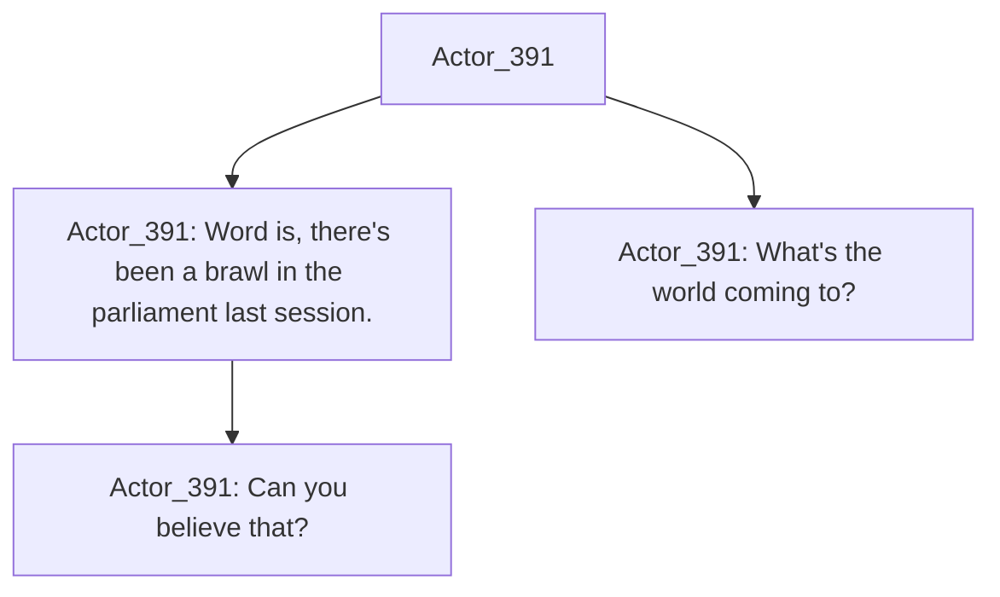

# Characters/Senol

```mermaid
graph TD
    391_0["Actor_391"]
    391_1["Actor_391: Word is, there's been a brawl in the parliament last session."]
    391_2["Actor_391: Can you believe that?"]
    391_3["Actor_391: What's the world coming to?"]
    391_0 --> 391_1
    391_0 --> 391_3
    391_1 --> 391_2
```