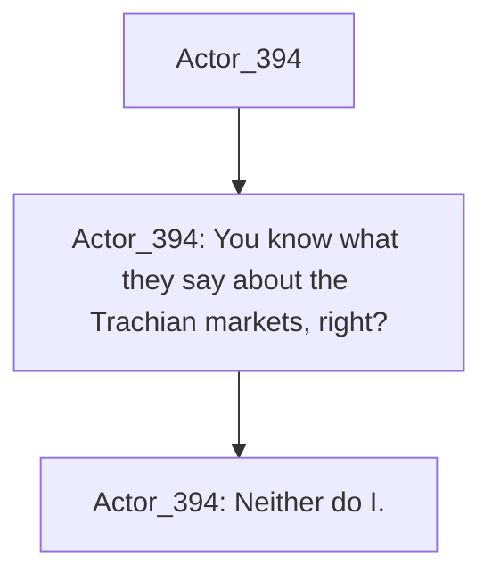

# Characters/Sergei

```mermaid
graph TD
    393_0["Actor_394"]
    393_1["Actor_394: You know what they say about the Trachian markets, right?"]
    393_2["Actor_394: Neither do I."]
    393_0 --> 393_1
    393_1 --> 393_2
```