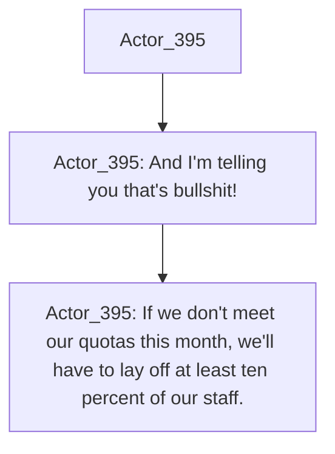

# Characters/Sergej

```mermaid
graph TD
    394_0["Actor_395"]
    394_1["Actor_395: And I'm telling you that's bullshit!"]
    394_2["Actor_395: If we don't meet our quotas this month, we'll have to lay off at least ten percent of our staff."]
    394_0 --> 394_1
    394_1 --> 394_2
```