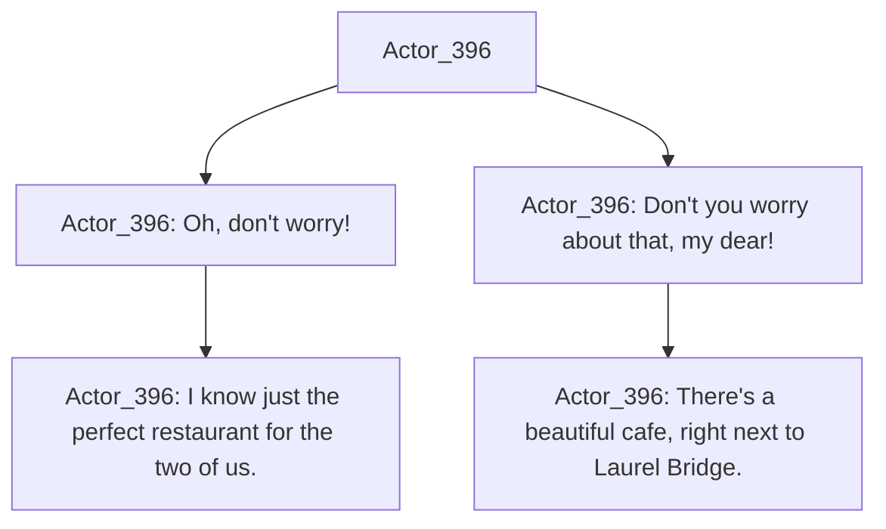

# Characters/Sergio

```mermaid
graph TD
    395_0["Actor_396"]
    395_1["Actor_396: Oh, don't worry!"]
    395_2["Actor_396: I know just the perfect restaurant for the two of us."]
    395_3["Actor_396: Don't you worry about that, my dear!"]
    395_4["Actor_396: There's a beautiful cafe, right next to Laurel Bridge."]
    395_0 --> 395_1
    395_0 --> 395_3
    395_1 --> 395_2
    395_3 --> 395_4
```