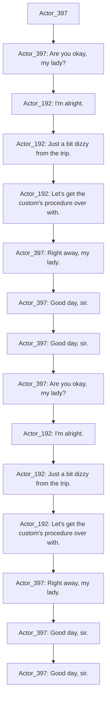

# Characters/Serval

```mermaid
graph TD
    396_0["Actor_397"]
    396_1["Actor_397: Are you okay, my lady?"]
    396_2["Actor_192: I'm alright."]
    396_3["Actor_192: Just a bit dizzy from the trip."]
    396_4["Actor_192: Let's get the custom's procedure over with."]
    396_5["Actor_397: Right away, my lady."]
    396_6["Actor_397: Good day, sir."]
    396_7["Actor_397: Good day, sir."]
    396_8["Actor_397: Are you okay, my lady?"]
    396_9["Actor_192: I'm alright."]
    396_10["Actor_192: Just a bit dizzy from the trip."]
    396_11["Actor_192: Let's get the custom's procedure over with."]
    396_12["Actor_397: Right away, my lady."]
    396_13["Actor_397: Good day, sir."]
    396_14["Actor_397: Good day, sir."]
    396_0 --> 396_1
    396_1 --> 396_2
    396_2 --> 396_3
    396_3 --> 396_4
    396_4 --> 396_5
    396_5 --> 396_6
    396_6 --> 396_7
    396_7 --> 396_8
    396_8 --> 396_9
    396_9 --> 396_10
    396_10 --> 396_11
    396_11 --> 396_12
    396_12 --> 396_13
    396_13 --> 396_14
```