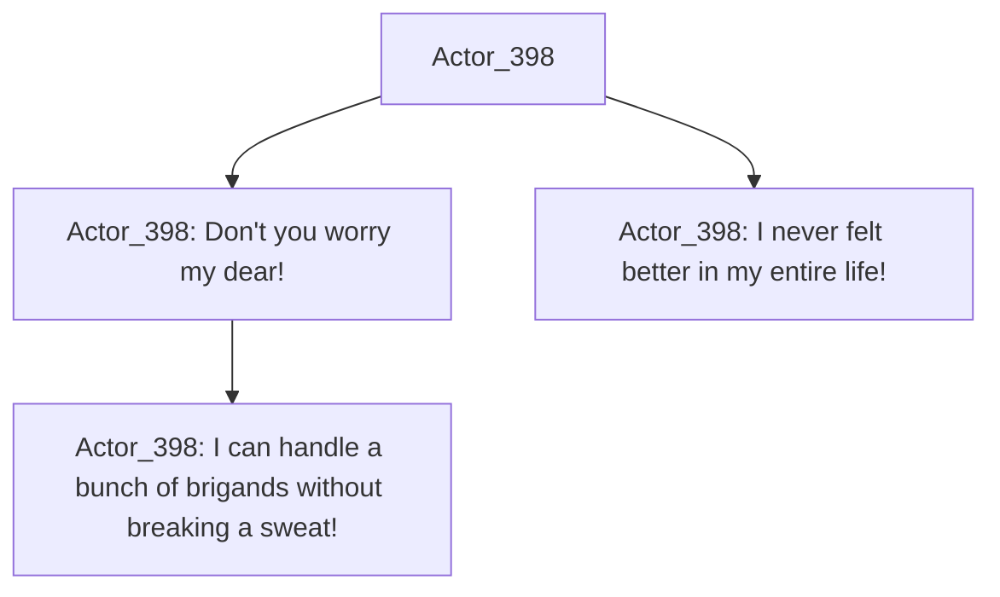

# Characters/Seyyit

```mermaid
graph TD
    397_0["Actor_398"]
    397_1["Actor_398: Don't you worry my dear!"]
    397_2["Actor_398: I can handle a bunch of brigands without breaking a sweat!"]
    397_3["Actor_398: I never felt better in my entire life!"]
    397_0 --> 397_1
    397_0 --> 397_3
    397_1 --> 397_2
```