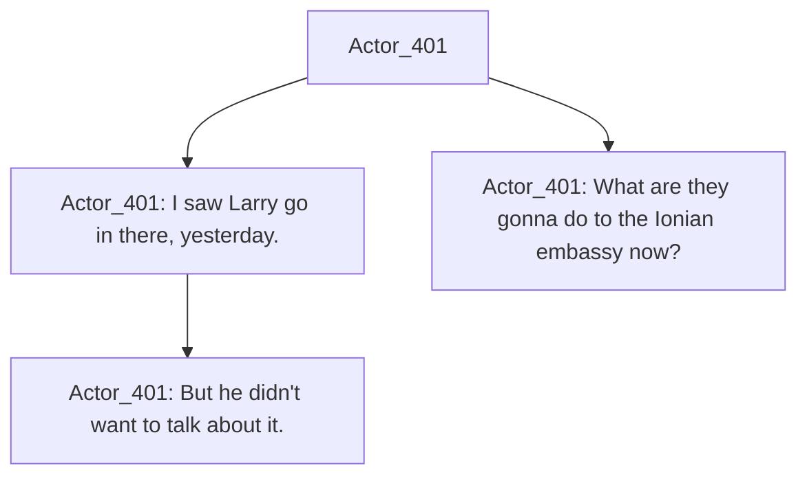

# Characters/Simon

```mermaid
graph TD
    400_0["Actor_401"]
    400_1["Actor_401: I saw Larry go in there, yesterday."]
    400_2["Actor_401: But he didn't want to talk about it."]
    400_3["Actor_401: What are they gonna do to the Ionian embassy now?"]
    400_0 --> 400_1
    400_0 --> 400_3
    400_1 --> 400_2
```