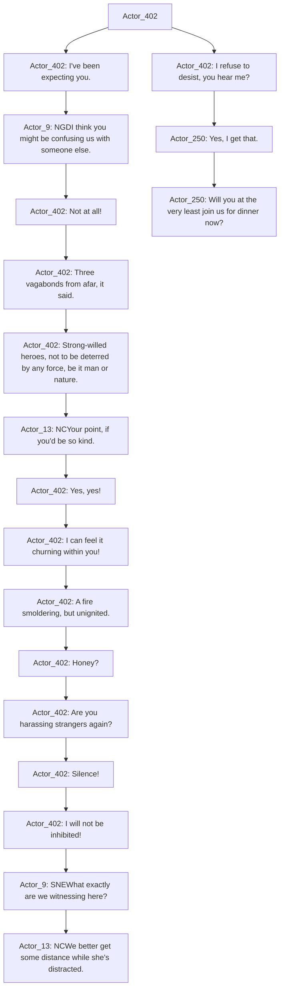

# Characters/Simona

```mermaid
graph TD
    401_0["Actor_402"]
    401_1["Actor_402: I've been expecting you."]
    401_2["Actor_9: NGDI think you might be confusing us with someone else."]
    401_3["Actor_402: Not at all!"]
    401_4["Actor_402: Three vagabonds from afar, it said."]
    401_5["Actor_402: Strong-willed heroes, not to be deterred by any force, be it man or nature."]
    401_6["Actor_13: NCYour point, if you'd be so kind."]
    401_7["Actor_402: Yes, yes!"]
    401_8["Actor_402: I can feel it churning within you!"]
    401_9["Actor_402: A fire smoldering, but unignited."]
    401_10["Actor_402: Honey?"]
    401_11["Actor_402: Are you harassing strangers again?"]
    401_12["Actor_402: Silence!"]
    401_13["Actor_402: I will not be inhibited!"]
    401_14["Actor_9: SNEWhat exactly are we witnessing here?"]
    401_15["Actor_13: NCWe better get some distance while she's distracted."]
    401_16["Actor_402: I refuse to desist, you hear me?"]
    401_17["Actor_250: Yes, I get that."]
    401_18["Actor_250: Will you at the very least join us for dinner now?"]
    401_0 --> 401_1
    401_0 --> 401_16
    401_1 --> 401_2
    401_2 --> 401_3
    401_3 --> 401_4
    401_4 --> 401_5
    401_5 --> 401_6
    401_6 --> 401_7
    401_7 --> 401_8
    401_8 --> 401_9
    401_9 --> 401_10
    401_10 --> 401_11
    401_11 --> 401_12
    401_12 --> 401_13
    401_13 --> 401_14
    401_14 --> 401_15
    401_16 --> 401_17
    401_17 --> 401_18
```