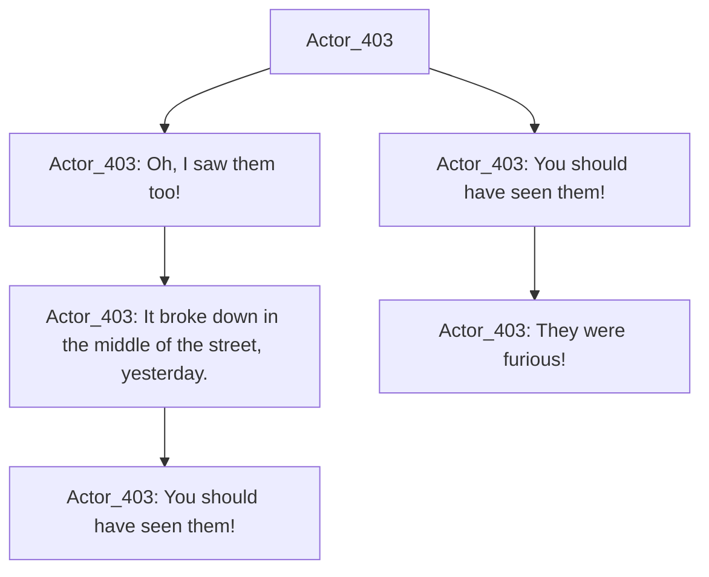

# Characters/Sofia

```mermaid
graph TD
    402_0["Actor_403"]
    402_1["Actor_403: Oh, I saw them too!"]
    402_2["Actor_403: It broke down in the middle of the street, yesterday."]
    402_3["Actor_403: You should have seen them!"]
    402_4["Actor_403: You should have seen them!"]
    402_5["Actor_403: They were furious!"]
    402_0 --> 402_1
    402_0 --> 402_4
    402_1 --> 402_2
    402_2 --> 402_3
    402_4 --> 402_5
```