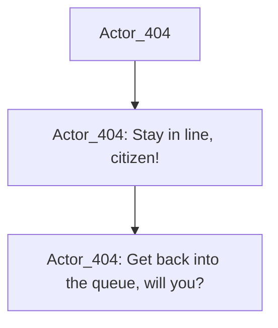

# Characters/Solen

```mermaid
graph TD
    403_0["Actor_404"]
    403_1["Actor_404: Stay in line, citizen!"]
    403_2["Actor_404: Get back into the queue, will you?"]
    403_0 --> 403_1
    403_1 --> 403_2
```