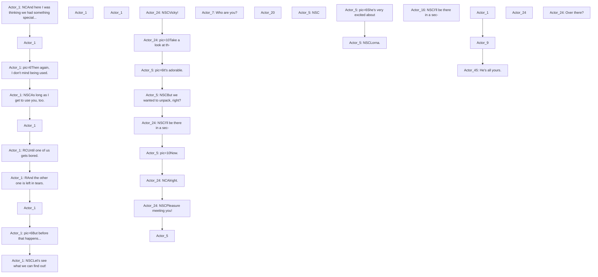

# Characters/Stamatis

```mermaid
graph TD
    67_0["Actor_1"]
    67_19["Actor_1"]
    67_26["Actor_1"]
    67_29["Actor_1: NCAnd here I was thinking we had something special..."]
    67_30["Actor_1"]
    67_31["Actor_1: pic=6Then again, I don't mind being used."]
    67_32["Actor_1: NSCAs long as I get to use you, too."]
    67_33["Actor_1"]
    67_34["Actor_1: pic=6But before that happens..."]
    67_36["Actor_1: NSCLet's see what we can find out!"]
    67_40["Actor_1: RCUntil one of us gets bored."]
    67_41["Actor_1: RAnd the other one is left in tears."]
    67_42["Actor_1"]
    67_75["Actor_7: Who are you?"]
    67_80["Actor_20"]
    67_83["Actor_9"]
    67_86["Actor_5: NSC"]
    67_88["Actor_5: NSCLorna."]
    67_90["Actor_24: NSCVicky!"]
    67_91["Actor_24: pic=10Take a look at th-"]
    67_92["Actor_5: pic=6It's adorable."]
    67_93["Actor_5: NSCBut we wanted to unpack, right?"]
    67_94["Actor_24: NSCI'll be there in a sec-"]
    67_95["Actor_5: pic=10Now."]
    67_96["Actor_16: NSCI'll be there in a sec-"]
    67_97["Actor_24: NCAlright."]
    67_98["Actor_24: NSCPleasure meeting you!"]
    67_102["Actor_5: pic=6She's very excited about "]
    67_104["Actor_24"]
    67_110["Actor_24: Over there?"]
    67_146["Actor_5"]
    67_149["Actor_45: He's all yours."]
    67_0 --> 67_83
    67_29 --> 67_30
    67_30 --> 67_31
    67_31 --> 67_32
    67_32 --> 67_33
    67_33 --> 67_40
    67_34 --> 67_36
    67_40 --> 67_41
    67_41 --> 67_42
    67_42 --> 67_34
    67_83 --> 67_149
    67_90 --> 67_91
    67_91 --> 67_92
    67_92 --> 67_93
    67_93 --> 67_94
    67_94 --> 67_95
    67_95 --> 67_97
    67_97 --> 67_98
    67_98 --> 67_146
    67_102 --> 67_88
```