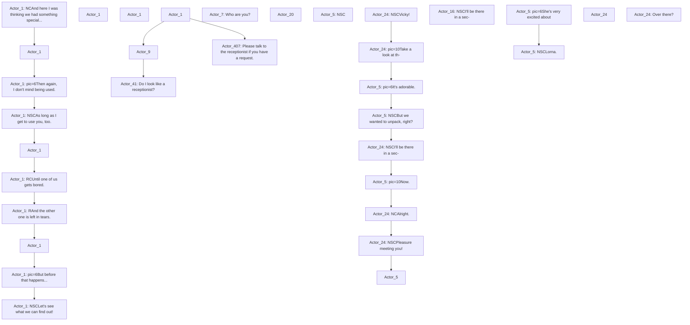

# Characters/Stelian

```mermaid
graph TD
    64_0["Actor_1"]
    64_1["Actor_407: Please talk to the receptionist if you have a request."]
    64_19["Actor_1"]
    64_26["Actor_1"]
    64_29["Actor_1: NCAnd here I was thinking we had something special..."]
    64_30["Actor_1"]
    64_31["Actor_1: pic=6Then again, I don't mind being used."]
    64_32["Actor_1: NSCAs long as I get to use you, too."]
    64_33["Actor_1"]
    64_34["Actor_1: pic=6But before that happens..."]
    64_36["Actor_1: NSCLet's see what we can find out!"]
    64_40["Actor_1: RCUntil one of us gets bored."]
    64_41["Actor_1: RAnd the other one is left in tears."]
    64_42["Actor_1"]
    64_75["Actor_7: Who are you?"]
    64_80["Actor_20"]
    64_83["Actor_9"]
    64_86["Actor_5: NSC"]
    64_88["Actor_5: NSCLorna."]
    64_90["Actor_24: NSCVicky!"]
    64_91["Actor_24: pic=10Take a look at th-"]
    64_92["Actor_5: pic=6It's adorable."]
    64_93["Actor_5: NSCBut we wanted to unpack, right?"]
    64_94["Actor_24: NSCI'll be there in a sec-"]
    64_95["Actor_5: pic=10Now."]
    64_96["Actor_16: NSCI'll be there in a sec-"]
    64_97["Actor_24: NCAlright."]
    64_98["Actor_24: NSCPleasure meeting you!"]
    64_102["Actor_5: pic=6She's very excited about "]
    64_104["Actor_24"]
    64_110["Actor_24: Over there?"]
    64_146["Actor_5"]
    64_149["Actor_41: Do I look like a receptionist?"]
    64_0 --> 64_83
    64_0 --> 64_1
    64_29 --> 64_30
    64_30 --> 64_31
    64_31 --> 64_32
    64_32 --> 64_33
    64_33 --> 64_40
    64_34 --> 64_36
    64_40 --> 64_41
    64_41 --> 64_42
    64_42 --> 64_34
    64_83 --> 64_149
    64_90 --> 64_91
    64_91 --> 64_92
    64_92 --> 64_93
    64_93 --> 64_94
    64_94 --> 64_95
    64_95 --> 64_97
    64_97 --> 64_98
    64_98 --> 64_146
    64_102 --> 64_88
```