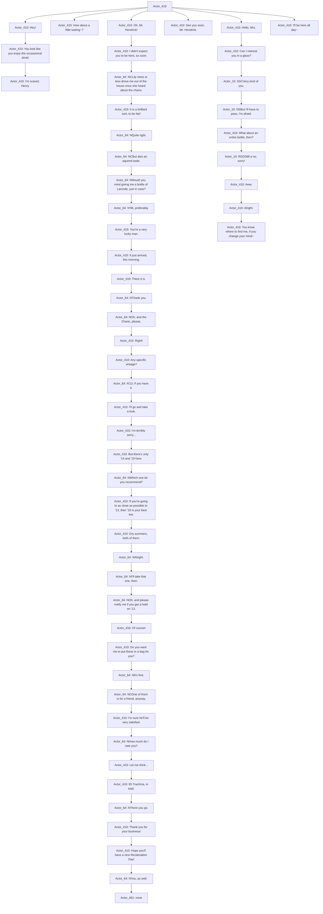

# Characters/Susanne

```mermaid
graph TD
    407_0["Actor_410"]
    407_1["Actor_410: Hey!"]
    407_2["Actor_410: You look like you enjoy the occassional drink!"]
    407_3["Actor_410: I'm scared, Henry."]
    407_4["Actor_410: How about a little tasting~?"]
    407_5["Actor_410: Oh, Mr. Hendrick!"]
    407_6["Actor_410: I didn't expect you to be here, so soon."]
    407_7["Actor_64: NCLily more or less drove me out of the house once she heard about the chario."]
    407_8["Actor_410: It is a brilliant sort, to be fair!"]
    407_9["Actor_64: NQuite right."]
    407_10["Actor_64: NCBut also an aquired taste."]
    407_11["Actor_64: NWould you mind giving me a bottle of Laronde, just in case?"]
    407_12["Actor_64: N'96, preferably."]
    407_13["Actor_410: You're a very lucky man."]
    407_14["Actor_410: It just arrived, this morning."]
    407_15["Actor_410: There it is."]
    407_16["Actor_64: NThank you."]
    407_17["Actor_64: NOh, and the Chario, please."]
    407_18["Actor_410: Right!"]
    407_19["Actor_410: Any specific vintage?"]
    407_20["Actor_64: N'13, if you have it."]
    407_21["Actor_410: I'll go and take a look."]
    407_22["Actor_410: I'm terribly sorry..."]
    407_23["Actor_410: But there's only '14 and '19 here."]
    407_24["Actor_64: NWhich one do you recommend?"]
    407_25["Actor_410: If you're going to as close as possible to '13, then '19 is your best bet."]
    407_26["Actor_410: Dry summers, both of them."]
    407_27["Actor_64: NAlright."]
    407_28["Actor_64: NI'll take that one, then."]
    407_29["Actor_64: NOh, and please notify me if you get a hold on '13."]
    407_30["Actor_410: Of course!"]
    407_31["Actor_410: Do you want me to put these in a bag for you?"]
    407_32["Actor_64: NIt's fine."]
    407_33["Actor_64: NCOne of them is for a friend, anyway."]
    407_34["Actor_410: I'm sure he'll be very satisfied."]
    407_35["Actor_64: NHow much do I owe you?"]
    407_36["Actor_410: Let me think..."]
    407_37["Actor_410: 85 Trachma, in total."]
    407_38["Actor_64: NThere you go."]
    407_39["Actor_410: Thank you for your business!"]
    407_40["Actor_410: Hope you'll have a nice Reclamation Day!"]
    407_41["Actor_64: NYou, as well."]
    407_42["Actor_461: none"]
    407_43["Actor_410: See you soon, Mr. Hendrick."]
    407_44["Actor_410: Hello, Mrs."]
    407_45["Actor_410: Can I interest you in a glass?"]
    407_46["Actor_10: SSCVery kind of you."]
    407_47["Actor_10: NSBut I'll have to pass, I'm afraid."]
    407_48["Actor_410: What about an entire bottle, then?"]
    407_49["Actor_10: RGDStill a no, sorry!"]
    407_50["Actor_410: Aww."]
    407_51["Actor_410: Alright."]
    407_52["Actor_410: You know where to find me, if you change your mind~"]
    407_53["Actor_410: I'll be here all day~"]
    407_0 --> 407_1
    407_0 --> 407_4
    407_0 --> 407_5
    407_0 --> 407_43
    407_0 --> 407_44
    407_0 --> 407_53
    407_1 --> 407_2
    407_2 --> 407_3
    407_5 --> 407_6
    407_6 --> 407_7
    407_7 --> 407_8
    407_8 --> 407_9
    407_9 --> 407_10
    407_10 --> 407_11
    407_11 --> 407_12
    407_12 --> 407_13
    407_13 --> 407_14
    407_14 --> 407_15
    407_15 --> 407_16
    407_16 --> 407_17
    407_17 --> 407_18
    407_18 --> 407_19
    407_19 --> 407_20
    407_20 --> 407_21
    407_21 --> 407_22
    407_22 --> 407_23
    407_23 --> 407_24
    407_24 --> 407_25
    407_25 --> 407_26
    407_26 --> 407_27
    407_27 --> 407_28
    407_28 --> 407_29
    407_29 --> 407_30
    407_30 --> 407_31
    407_31 --> 407_32
    407_32 --> 407_33
    407_33 --> 407_34
    407_34 --> 407_35
    407_35 --> 407_36
    407_36 --> 407_37
    407_37 --> 407_38
    407_38 --> 407_39
    407_39 --> 407_40
    407_40 --> 407_41
    407_41 --> 407_42
    407_44 --> 407_45
    407_45 --> 407_46
    407_46 --> 407_47
    407_47 --> 407_48
    407_48 --> 407_49
    407_49 --> 407_50
    407_50 --> 407_51
    407_51 --> 407_52
```