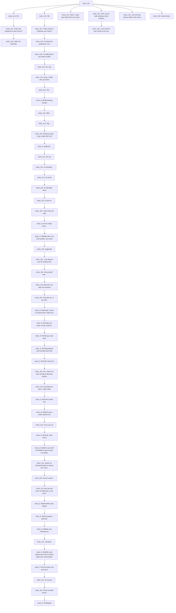

# Characters/Suzana

```mermaid
graph TD
    408_0["Actor_411"]
    408_1["Actor_411: Oh!"]
    408_2["Actor_411: That's the parliament, down there!?"]
    408_3["Actor_411: Hello, Mr. Hendrick."]
    408_4["Actor_411: Oh!"]
    408_5["Actor_411: That's Amryn's embassy over there!?"]
    408_6["Actor_411: So that's the parliament, hm?"]
    408_7["Actor_411: I'd really like to see what's inside."]
    408_8["Actor_411: Oh, hey."]
    408_9["Actor_411: Sorry, I didn't see you there."]
    408_10["Actor_411: Hm..."]
    408_11["Actor_9: NESomething wrong?"]
    408_12["Actor_411: Mhh..."]
    408_13["Actor_411: Say..."]
    408_14["Actor_411: Would you like to go a date with me?"]
    408_15["Actor_9: SNEUhh..."]
    408_16["Actor_411: Oh my!"]
    408_17["Actor_411: So hesitant..."]
    408_18["Actor_411: So timid!"]
    408_19["Actor_411: It's decided, then!"]
    408_20["Actor_411: Come on."]
    408_21["Actor_411: I don't have all day!"]
    408_22["Actor_9: SCI'm really sorry..."]
    408_23["Actor_9: SNEBut this is all a bit sudden, you know."]
    408_24["Actor_411: Hogwash!"]
    408_25["Actor_411: Love doesn't care for earthly time."]
    408_26["Actor_411: Set yourself free..."]
    408_27["Actor_411: Become one with your desires!"]
    408_28["Actor_411: And with me, if you like~"]
    408_29["Actor_9: SNEYeah, I think I'm gonna pass, thank you."]
    408_30["Actor_9: SGCBut you know, I have a friend..."]
    408_31["Actor_9: SSTall guy, blue eyes."]
    408_32["Actor_9: SGCMoustache and combed back hair."]
    408_33["Actor_9: SGCan't miss him."]
    408_34["Actor_411: Oh, I think I've seen someone like that, before!"]
    408_35["Actor_411: He looked so stern, I didn't dare."]
    408_36["Actor_9: NSCHe's pretty shy."]
    408_37["Actor_9: NGDIt's just a mask, believe me."]
    408_38["Actor_411: If you say so!"]
    408_39["Actor_9: NSYeah, don't worry!"]
    408_40["Actor_9: NGDI'm sure he'll be thrilled to get to know you better."]
    408_41["Actor_411: Great! I'm looking forward to seeing him, then~"]
    408_42["Actor_411: And of course..."]
    408_43["Actor_411: We can still have our little fling, if you want~"]
    408_44["Actor_9: NGDAnother time, maybe."]
    408_45["Actor_9: NSCAnyways, I gotta go."]
    408_46["Actor_9: NSWas nice meeting you."]
    408_47["Actor_411: Likewise~"]
    408_48["Actor_9: NGDOh, and please don't tell my friend about this conversation."]
    408_49["Actor_9: NSYou know, shy and such."]
    408_50["Actor_411: Of course!"]
    408_51["Actor_411: It'll be our little secret~"]
    408_52["Actor_9: NGDRight!"]
    408_53["Actor_411: Hehe, I hope your friend turns up, soon~"]
    408_54["Actor_411: Ohh, do you look dashing in that uniform!"]
    408_55["Actor_411: I can't wait for your friend to turn up~"]
    408_56["Actor_411: Just one last dance, before they close."]
    408_57["Actor_411: Almost there."]
    408_0 --> 408_1
    408_0 --> 408_4
    408_0 --> 408_53
    408_0 --> 408_54
    408_0 --> 408_56
    408_0 --> 408_57
    408_1 --> 408_2
    408_2 --> 408_3
    408_4 --> 408_5
    408_5 --> 408_6
    408_6 --> 408_7
    408_7 --> 408_8
    408_8 --> 408_9
    408_9 --> 408_10
    408_10 --> 408_11
    408_11 --> 408_12
    408_12 --> 408_13
    408_13 --> 408_14
    408_14 --> 408_15
    408_15 --> 408_16
    408_16 --> 408_17
    408_17 --> 408_18
    408_18 --> 408_19
    408_19 --> 408_20
    408_20 --> 408_21
    408_21 --> 408_22
    408_22 --> 408_23
    408_23 --> 408_24
    408_24 --> 408_25
    408_25 --> 408_26
    408_26 --> 408_27
    408_27 --> 408_28
    408_28 --> 408_29
    408_29 --> 408_30
    408_30 --> 408_31
    408_31 --> 408_32
    408_32 --> 408_33
    408_33 --> 408_34
    408_34 --> 408_35
    408_35 --> 408_36
    408_36 --> 408_37
    408_37 --> 408_38
    408_38 --> 408_39
    408_39 --> 408_40
    408_40 --> 408_41
    408_41 --> 408_42
    408_42 --> 408_43
    408_43 --> 408_44
    408_44 --> 408_45
    408_45 --> 408_46
    408_46 --> 408_47
    408_47 --> 408_48
    408_48 --> 408_49
    408_49 --> 408_50
    408_50 --> 408_51
    408_51 --> 408_52
    408_54 --> 408_55
```