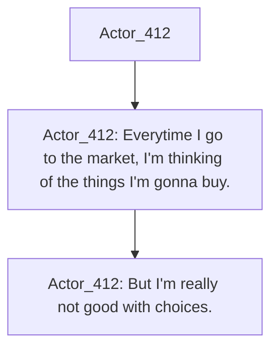

# Characters/Sylvaine

```mermaid
graph TD
    409_0["Actor_412"]
    409_1["Actor_412: Everytime I go to the market, I'm thinking of the things I'm gonna buy."]
    409_2["Actor_412: But I'm really not good with choices."]
    409_0 --> 409_1
    409_1 --> 409_2
```