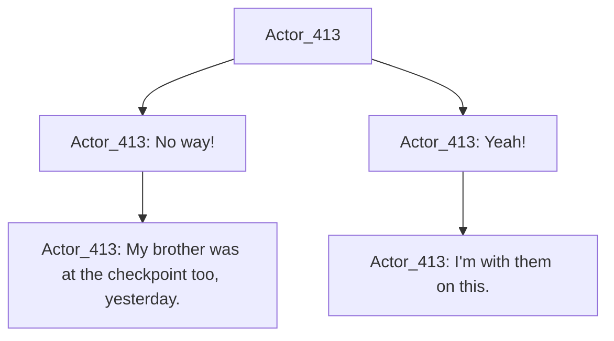

# Characters/Tadeo

```mermaid
graph TD
    410_0["Actor_413"]
    410_1["Actor_413: No way!"]
    410_2["Actor_413: My brother was at the checkpoint too, yesterday."]
    410_3["Actor_413: Yeah!"]
    410_4["Actor_413: I'm with them on this."]
    410_0 --> 410_1
    410_0 --> 410_3
    410_1 --> 410_2
    410_3 --> 410_4
```