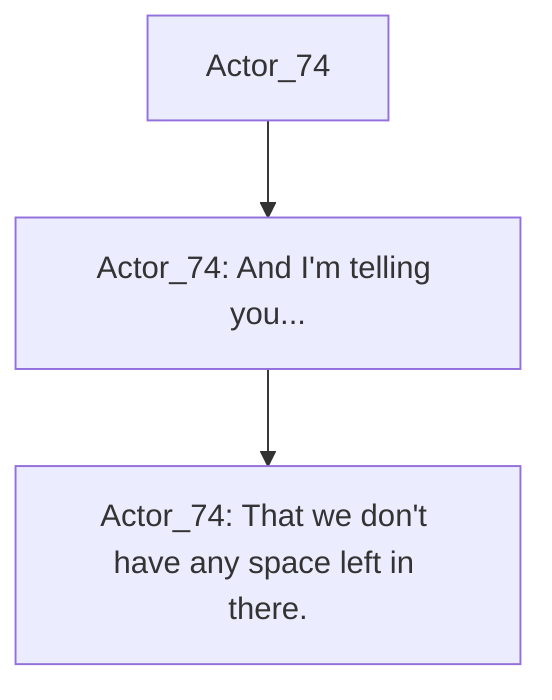

# Characters/Tarik

```mermaid
graph TD
    413_0["Actor_74"]
    413_1["Actor_74: And I'm telling you..."]
    413_2["Actor_74: That we don't have any space left in there."]
    413_0 --> 413_1
    413_1 --> 413_2
```