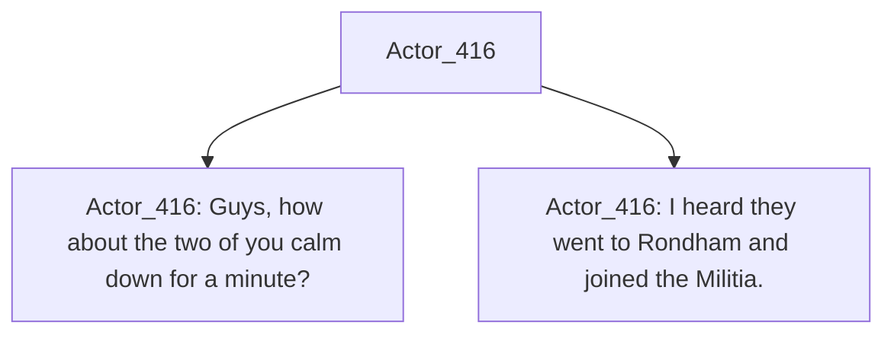

# Characters/Ted

```mermaid
graph TD
    414_0["Actor_416"]
    414_1["Actor_416: Guys, how about the two of you calm down for a minute?"]
    414_2["Actor_416: I heard they went to Rondham and joined the Militia."]
    414_0 --> 414_1
    414_0 --> 414_2
```