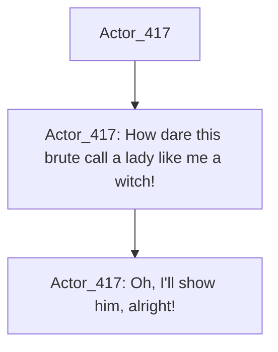

# Characters/Tereza

```mermaid
graph TD
    415_0["Actor_417"]
    415_1["Actor_417: How dare this brute call a lady like me a witch!"]
    415_2["Actor_417: Oh, I'll show him, alright!"]
    415_0 --> 415_1
    415_1 --> 415_2
```