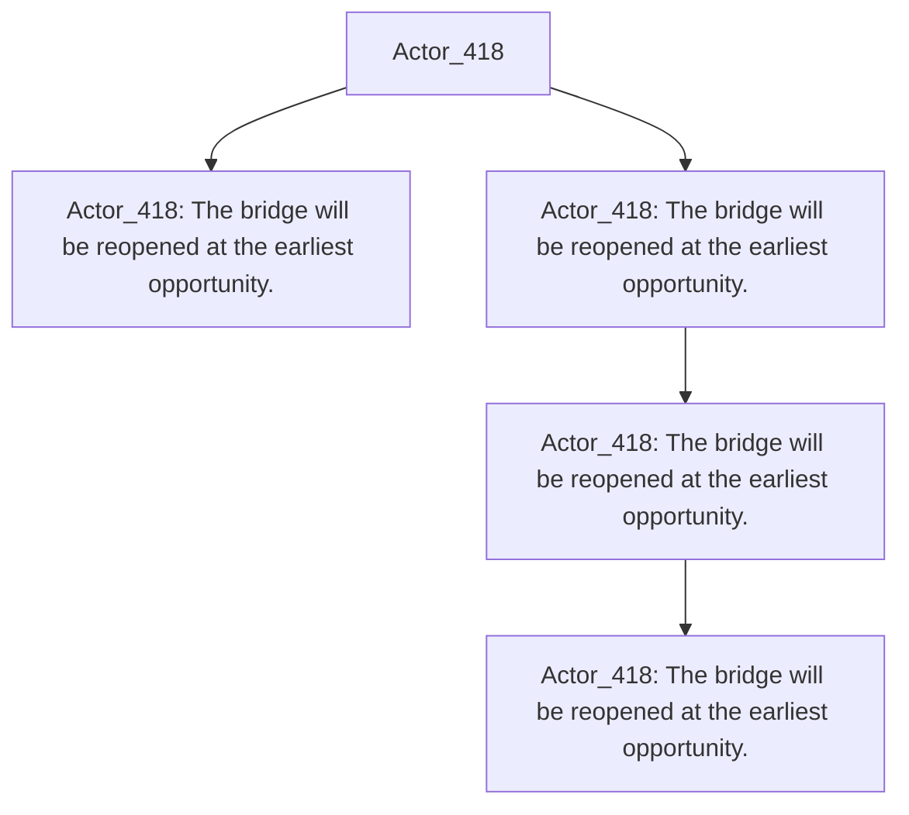

# Characters/Terrell

```mermaid
graph TD
    416_0["Actor_418"]
    416_1["Actor_418: The bridge will be reopened at the earliest opportunity."]
    416_2["Actor_418: The bridge will be reopened at the earliest opportunity."]
    416_3["Actor_418: The bridge will be reopened at the earliest opportunity."]
    416_4["Actor_418: The bridge will be reopened at the earliest opportunity."]
    416_0 --> 416_1
    416_0 --> 416_2
    416_2 --> 416_3
    416_3 --> 416_4
```