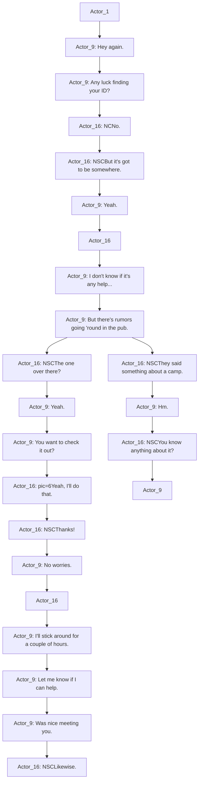

# Characters/Theo

```mermaid
graph TD
    36_0["Actor_1"]
    36_83["Actor_9: Hey again."]
    36_147["Actor_9: Any luck finding your ID?"]
    36_148["Actor_16: NCNo."]
    36_149["Actor_9: Yeah."]
    36_150["Actor_9: I don't know if it's any help..."]
    36_151["Actor_16: NSCBut it's got to be somewhere."]
    36_152["Actor_16"]
    36_153["Actor_9: But there's rumors going 'round in the pub."]
    36_154["Actor_9: Yeah."]
    36_155["Actor_16: NSCThe one over there?"]
    36_156["Actor_9: You want to check it out?"]
    36_157["Actor_16: pic=6Yeah, I'll do that."]
    36_158["Actor_16: NSCThanks!"]
    36_159["Actor_9: No worries."]
    36_160["Actor_9: Was nice meeting you."]
    36_161["Actor_16: NSCLikewise."]
    36_162["Actor_9: I'll stick around for a couple of hours."]
    36_163["Actor_9: Let me know if I can help."]
    36_164["Actor_16"]
    36_165["Actor_16: NSCThey said something about a camp."]
    36_166["Actor_9: Hm."]
    36_167["Actor_16: NSCYou know anything about it?"]
    36_168["Actor_9"]
    36_0 --> 36_83
    36_83 --> 36_147
    36_147 --> 36_148
    36_148 --> 36_151
    36_149 --> 36_152
    36_150 --> 36_153
    36_151 --> 36_149
    36_152 --> 36_150
    36_153 --> 36_155
    36_153 --> 36_165
    36_154 --> 36_156
    36_155 --> 36_154
    36_156 --> 36_157
    36_157 --> 36_158
    36_158 --> 36_159
    36_159 --> 36_164
    36_160 --> 36_161
    36_162 --> 36_163
    36_163 --> 36_160
    36_164 --> 36_162
    36_165 --> 36_166
    36_166 --> 36_167
    36_167 --> 36_168
```