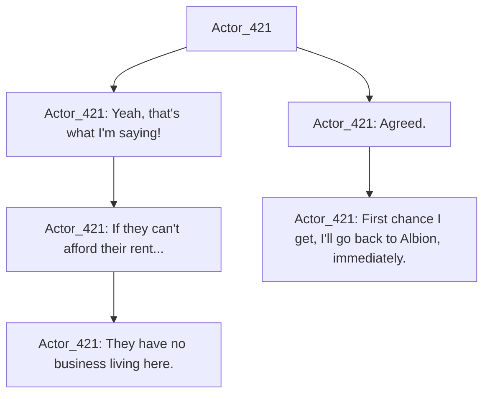

# Characters/Timofey

```mermaid
graph TD
    419_0["Actor_421"]
    419_1["Actor_421: Yeah, that's what I'm saying!"]
    419_2["Actor_421: If they can't afford their rent..."]
    419_3["Actor_421: They have no business living here."]
    419_4["Actor_421: Agreed."]
    419_5["Actor_421: First chance I get, I'll go back to Albion, immediately."]
    419_0 --> 419_1
    419_0 --> 419_4
    419_1 --> 419_2
    419_2 --> 419_3
    419_4 --> 419_5
```