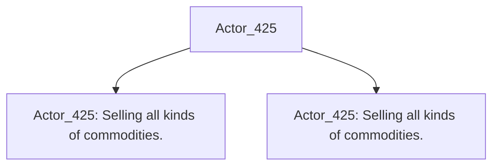

# Characters/Urbano

```mermaid
graph TD
    423_0["Actor_425"]
    423_1["Actor_425: Selling all kinds of commodities."]
    423_2["Actor_425: Selling all kinds of commodities."]
    423_0 --> 423_1
    423_0 --> 423_2
```