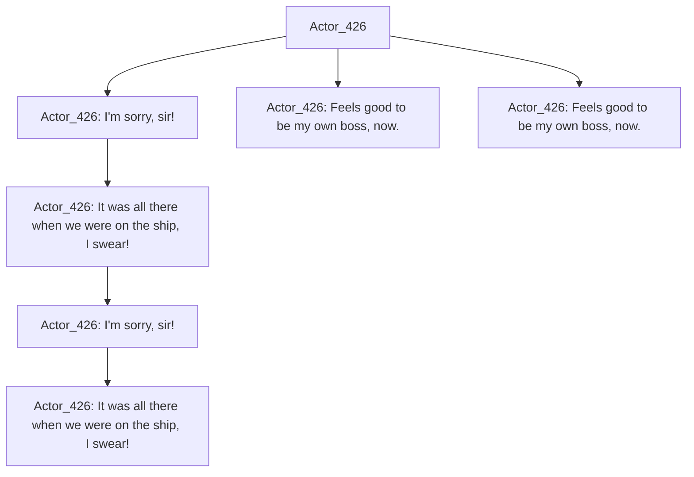

# Characters/Valens

```mermaid
graph TD
    424_0["Actor_426"]
    424_1["Actor_426: I'm sorry, sir!"]
    424_2["Actor_426: It was all there when we were on the ship, I swear!"]
    424_3["Actor_426: I'm sorry, sir!"]
    424_4["Actor_426: It was all there when we were on the ship, I swear!"]
    424_5["Actor_426: Feels good to be my own boss, now."]
    424_6["Actor_426: Feels good to be my own boss, now."]
    424_0 --> 424_1
    424_0 --> 424_5
    424_0 --> 424_6
    424_1 --> 424_2
    424_2 --> 424_3
    424_3 --> 424_4
```