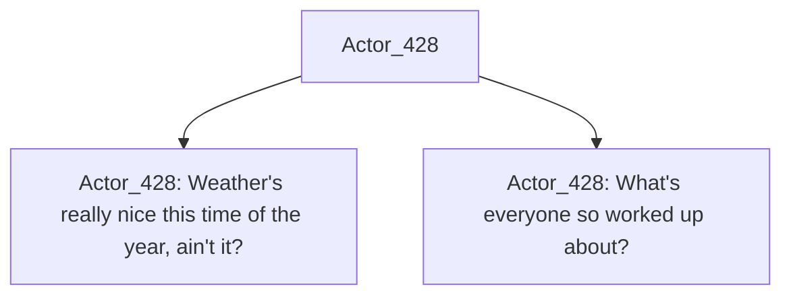

# Characters/Valentina

```mermaid
graph TD
    426_0["Actor_428"]
    426_1["Actor_428: Weather's really nice this time of the year, ain't it?"]
    426_2["Actor_428: What's everyone so worked up about?"]
    426_0 --> 426_1
    426_0 --> 426_2
```